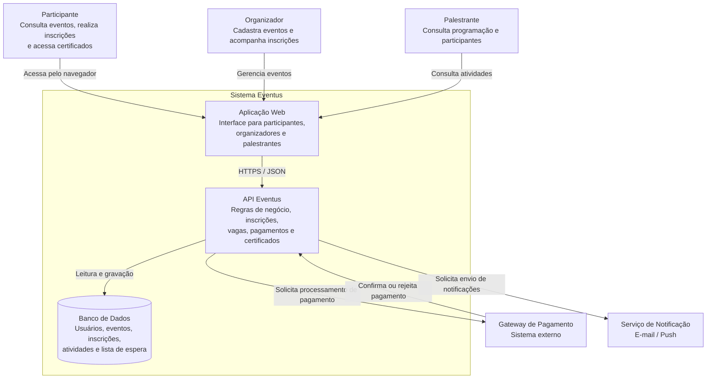
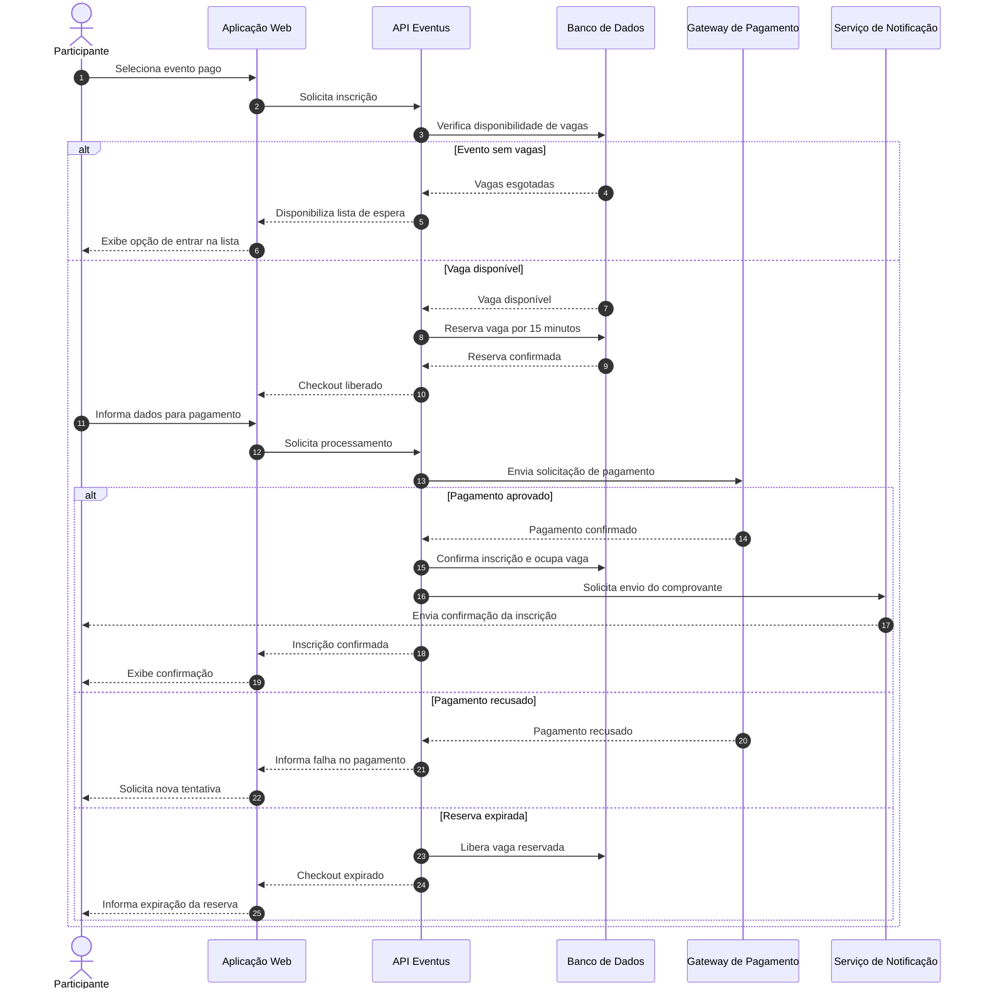

# Sistema Eventus — Discovery com Diagrams as Code

Atividade de documentação arquitetural utilizando **Diagrams as Code**, **Mermaid** e **Inteligência Artificial Generativa (GenAI)**.

O sistema escolhido é o **Eventus**, uma plataforma de gestão de eventos desenvolvida anteriormente na disciplina de Engenharia de Requisitos. Esta documentação evolui os requisitos existentes para uma visão arquitetural versionável.

Projeto anterior: <https://github.com/lucaseuz/analise_requisistos_sist_eventus>

## 1. Descrição do sistema

O Eventus permite que participantes encontrem eventos, realizem inscrições e pagamentos e acompanhem suas participações. Organizadores cadastram eventos e atividades, definem vagas e acompanham inscrições. Palestrantes consultam sua programação e informações autorizadas sobre participantes.

O sistema também contempla lista de espera, cancelamentos, reembolsos e emissão de certificados. Seu objetivo é centralizar informações que normalmente ficam distribuídas entre formulários, planilhas, ferramentas de pagamento e comunicação.

### Atores principais

| Ator | Responsabilidades |
| --- | --- |
| Participante | Consultar eventos, inscrever-se, pagar, cancelar quando permitido, entrar na lista de espera e acessar certificados. |
| Organizador | Cadastrar e administrar eventos, atividades, vagas e políticas de cancelamento/reembolso. |
| Palestrante | Consultar programação e dados de participantes autorizados. |

## 2. Escopo, limites e integrações

Esta documentação prioriza o fluxo de inscrição em eventos: consulta, controle de vagas, reserva temporária, pagamento, confirmação, lista de espera e notificações.

A visão estrutural é inspirada no nível de **Containers do modelo C4**. Ela não define tecnologias de implementação; demonstra responsabilidades e fronteiras do sistema.

| Elemento | Responsabilidade |
| --- | --- |
| Aplicação Web | Interface de acesso para participantes, organizadores e palestrantes. |
| API Eventus | Regras de negócio, inscrições, vagas, pagamentos e certificados. |
| Banco de Dados | Persistência de usuários, eventos, atividades, inscrições e lista de espera. |
| Gateway de Pagamento | Sistema externo que processa transações financeiras. |
| Serviço de Notificação | Sistema externo que envia e-mails, comprovantes e avisos. |

A Aplicação Web se comunica com a API por HTTPS. A API coordena as regras de negócio, persiste dados no banco e integra-se aos serviços externos; a aplicação web não acessa diretamente o banco, o gateway ou o serviço de notificação.

## 3. Regras e restrições consideradas

- **RN01 — Conflito de horários:** o participante não pode se inscrever em atividades com horários sobrepostos.
- **RN02 — Cancelamento:** cada evento pode possuir política específica de cancelamento.
- **RN03 — Reembolso:** segue a política configurada para o evento e regras financeiras do sistema.
- **RN04 — Reserva temporária:** no checkout de evento pago, a vaga fica reservada por 15 minutos; sem confirmação de pagamento, a reserva expira e a vaga retorna ao inventário.
- **RN05 — Lista de espera:** com o evento lotado, o participante pode entrar na fila e será notificado quando uma vaga ficar disponível.
- **RN06 — Certificados:** dependem dos critérios mínimos de participação definidos pelo evento.
- **RN07 — Limite de vagas:** inscrições confirmadas nunca podem ultrapassar a capacidade configurada.
- **RN08 — Privacidade:** o tratamento de dados deve respeitar os requisitos de proteção de dados do sistema.

## 4. Diagrama estrutural

O diagrama abaixo apresenta a visão de containers do Eventus. Os atores, o gateway de pagamento e o serviço de notificação estão fora da fronteira do sistema.

O fonte do diagrama está em [diagrams/containers.mmd](diagrams/containers.mmd).

## 5. Diagrama comportamental

A jornada crítica escolhida é a inscrição em evento pago. O fluxo verifica a disponibilidade, cria uma reserva temporária, processa o pagamento e confirma a inscrição somente depois do retorno positivo do gateway. Também apresenta os caminhos alternativos de evento lotado, pagamento recusado e reserva expirada.

O fonte do diagrama está em [diagrams/inscricao-evento-pago.mmd](diagrams/inscricao-evento-pago.mmd).

### Análise da jornada

Uma vaga não é definitivamente ocupada no início do checkout: primeiro é criada uma reserva de 15 minutos. Após a confirmação do pagamento, a reserva é convertida em inscrição confirmada. Se o pagamento não for concluído no prazo, a vaga volta a ficar disponível. Essa estratégia reduz o risco de dois participantes adquirirem a última vaga simultaneamente.

## 6. Uso de Inteligência Artificial Generativa

A GenAI foi usada como apoio para converter requisitos existentes em diagramas Mermaid. As sugestões não foram aceitas automaticamente: foram revisadas conforme regras de negócio documentadas no projeto anterior.

| Aspecto | Sugestão inicial | Decisão / ajuste | Motivo |
| --- | --- | --- | --- |
| Arquitetura | Uma única aplicação | Aplicação Web, API e banco separados | Tornar responsabilidades explícitas. |
| Pagamento | Confirmar inscrição antes do retorno financeiro | Confirmar somente após aprovação do gateway | A confirmação financeira é necessária. |
| Controle de vagas | Baixar a vaga somente após pagamento | Reservar temporariamente durante o checkout | Evitar concorrência pela última vaga. |
| Reserva | Sem duração definida | Reserva de 15 minutos | Regra de negócio do Eventus. |
| Evento lotado | Encerrar inscrição | Oferecer lista de espera | Funcionalidade prevista nos requisitos. |
| Lista de espera | Cobrança automática | Notificar antes de uma nova inscrição | Evitar cobrança sem confirmação. |
| Dados do palestrante | Acesso amplo aos participantes | Restringir dados apresentados | Privacidade e proteção de dados. |

## 7. Lacunas e decisões futuras

As tecnologias de frontend, backend, banco de dados, autenticação, gateway de pagamento, serviço de notificações, infraestrutura e monitoramento ainda não foram definidas. Também será necessário detalhar contratos da API e a estratégia técnica para garantir reservas atômicas de vagas. Essas lacunas foram registradas em vez de assumir tecnologias sem validação dos requisitos.

## 8. Conclusão

Diagrams as Code permitiu transformar os requisitos do Eventus em uma documentação arquitetural versionável. O diagrama estrutural evidencia os limites e responsabilidades da solução; o diagrama de sequência explica a jornada mais crítica de inscrição paga. A GenAI acelerou a modelagem inicial, enquanto a revisão humana assegurou aderência aos requisitos do sistema.

